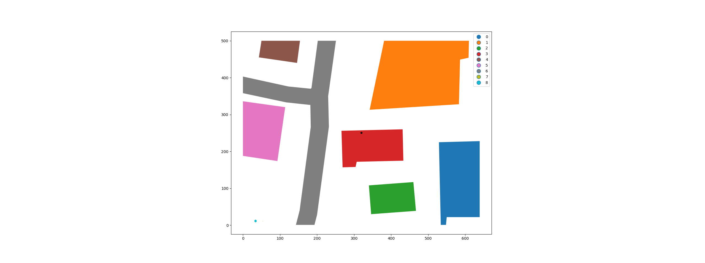
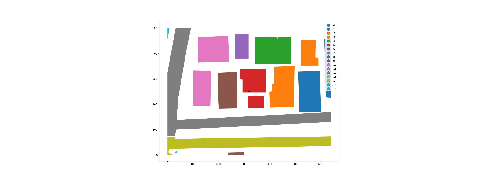
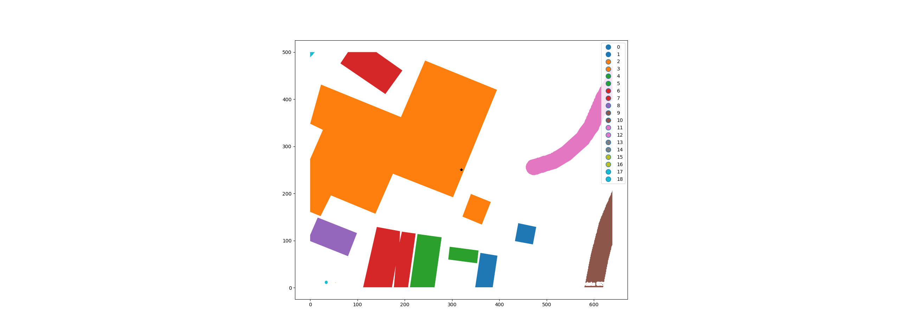
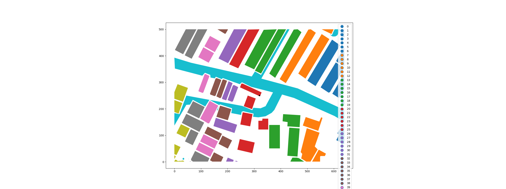
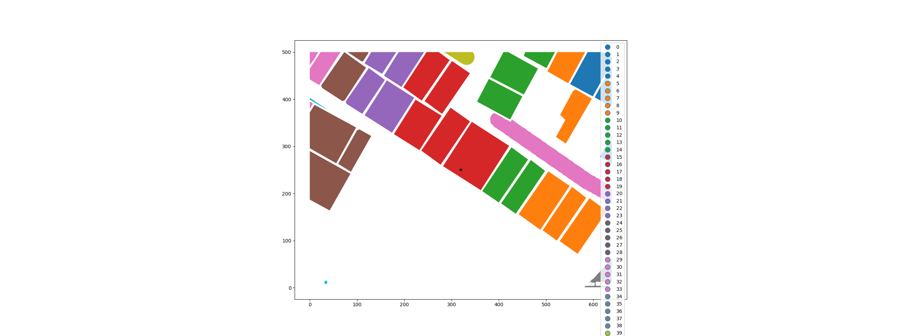
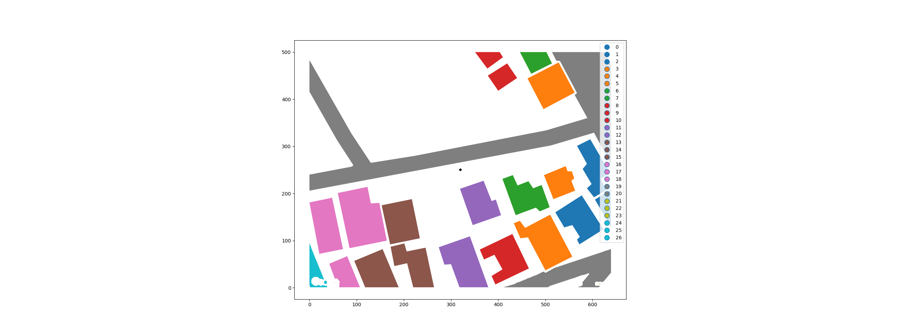
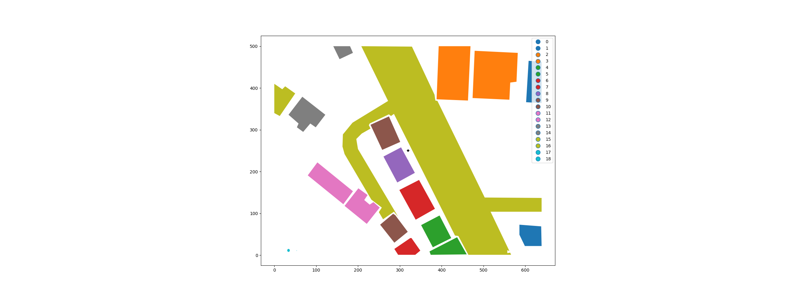
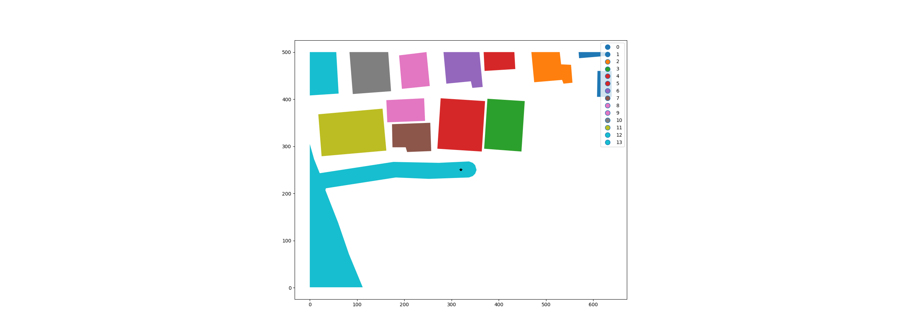
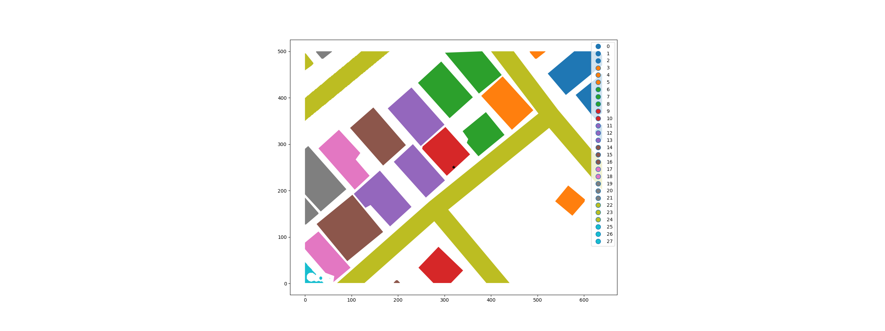

# Output

```bash
Namespace(filepath='./Data/wip/geoms_tmp_1.geojson')

Index of the building within/closest to which the anchor point lies: 3
Index of the building closest to front side: 1
Distance to the closest building from the front side: 55.141 units
Distance to the closest road from the front side: 35.159 units

geoms_tmp_1.geojson, 35.159 units, "Road"
```



```bash
Namespace(filepath='./Data/wip/geoms_tmp_2.geojson')

Index of the building within/closest to which the anchor point lies: 5
Index of the building closest to front side: 6
Distance to the closest building from the front side: 14.0 units
Distance to the closest road from the front side: 89.93 units

geoms_tmp_2.geojson, 14.0 units, "Building"
```



```bash
Namespace(filepath='./Data/wip/geoms_tmp_3.geojson')

Index of the building within/closest to which the anchor point lies: 2
Index of the building closest to front side: 3
Distance to the closest building from the front side: 32.542 units
Distance to the closest road from the front side: 117.082 units

geoms_tmp_3.geojson, 32.542 units, "Building"
```



```bash
Namespace(filepath='./Data/wip/geoms_tmp_4.geojson')

Index of the building within/closest to which the anchor point lies: 21
Index of the building closest to front side: 27
Distance to the closest building from the front side: 7.071 units
Distance to the closest road from the front side: 12.042 units

geoms_tmp_4.geojson, 7.071 units, "Building"
```



```bash
Namespace(filepath='./Data/wip/geoms_tmp_5.geojson')

Index of the building within/closest to which the anchor point lies: 15
Index of the building closest to front side: 24
Distance to the closest building from the front side: 164.924 units
Distance to the closest road from the front side: 126.857 units

geoms_tmp_5.geojson, 126.857 units, "Road"
```



```bash
Namespace(filepath='./Data/wip/geoms_tmp_6.geojson')

Index of the building within/closest to which the anchor point lies: 11
Index of the building closest to anchor point: 9
Distance to the closest building from the anchor point: 185.84 units
Distance to the closest road from the anchor point: 15.142 units

geoms_tmp_6.geojson, 15.142 units, "Road"
```



```bash
Namespace(filepath='./Data/wip/geoms_tmp_7.geojson')

Index of the building within/closest to which the anchor point lies: 8
Index of the building closest to anchor point: 3
Distance to the closest building from the anchor point: 140.351 units
Distance to the closest road from the anchor point: 9.296 units

geoms_tmp_7.geojson, 9.296 units, "Road"
```



```bash
Namespace(filepath='./Data/wip/geoms_tmp_8.geojson')

Index of the building within/closest to which the anchor point lies: 5
No building on the front side of the building wrt anchor point
Distance to the closest road from the anchor point: 0.0 units

geoms_tmp_8.geojson, 0.0 units, "Road"
```



```bash
Namespace(filepath='./Data/wip/geoms_tmp_9.geojson')

Index of the building within/closest to which the anchor point lies: 9
Index of the building closest to front side: 10
Distance to the closest building from the front side: 154.055 units
Distance to the closest road from the front side: 19.656 units

geoms_tmp_9.geojson, 19.656 units, "Road"
```


