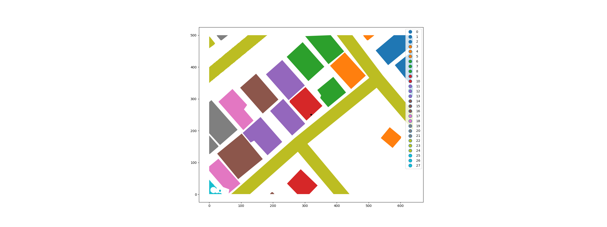

# CV Task
## Distance to nearest building/road from the front side of the building

### Instructions
Raw data in the `./Data/raw` folder contains a set of images with samples of road / buildings / vegetation cover

Image dimension : 640 x 500

The midpoint of each image is considered as the location of a shop.

Find the distance from the front side of the shop to the nearest road/building in
the same direction.

For example: (x,y) is the anchor point which lies inside the building (A B C D ) polygon. The
anchor point is closest to the side AB and hence is the front side of the building.The distance in
this case will be from AB to the road and not the other building.

In some cases the anchor point might not be within the bound of a building, in which
case, it would be the distance from the anchor point instead of the line segment.

### Running Code

Modules used are found in the `requirements.txt`. Run with `pip install -r requirements.txt` to set up the 
environment.

Run the `polygons_detection.py` file first with inputs to get the roads and building polygons identified and
exported into a geojson file for each image.
```bash
usage: polygons_detection.py [-h] [-pngpath PNGPATH] [-outpath OUTPATH]

optional arguments:
  -h, --help        show this help message and exit
  -pngpath PNGPATH  Path to folder containing raw images.
  -outpath OUTPATH  Path to folder for exporting output images
```

Once the the geojson files are populated, run the `get_distance.py` file with path to geojson file to get the
distance to the closest building or road from the front side/anchor point.
```bash
usage: get_distance.py [-h] [-filepath FILEPATH]

optional arguments:
  -h, --help          show this help message and exit
  -filepath FILEPATH  Path to geojson file with road and building polygons.
```

Once the the file is run the output is printed as below, along with a matplotlib plot that shows the polygons and
the anchor point with their index numbers.
```bash
Namespace(filepath='./Data/wip/geoms_tmp_9.geojson')

Index of the building within/closest to which the anchor point lies: 9
Index of the building closest to front side: 10
Distance to the closest building from the front side: 154.055 units
Distance to the closest road from the front side: 19.656 units

geoms_tmp_9.geojson, 19.656, "Road"
```
Output Map from Matplotlib


Check all outputs [here](Data/clean/outputs.md)